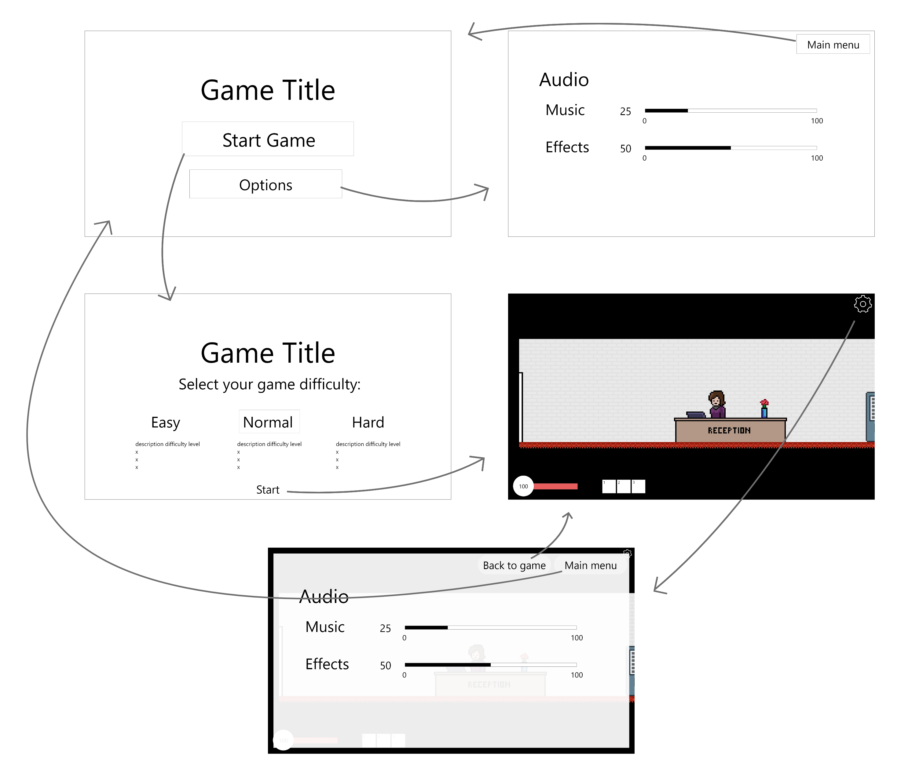

# Startdocument

Development team:

| Name             | Student Number |
| ---------------- | -------------- |
| Stefan Untura    | **4839161**    |
| Victor Tromp     | **4922972**    |
| Line Amini Kaveh | **4929284**    |
| Josta Holsappel  | **4785428**    |

## Game Concept

- The idea is to create a game that is reminiscent of "Hollow Knight" and dungeon crawlers, but operates on a much more  rudimentary level graphically. 

  The individual levels will be two-dimensional, although the team may later opt to do particular scenes using a different perspective. The protagonist is an IT student at NHL Stenden who will need to progress through different levels to ultimately reach  graduation. The level design is not entirely static either, as it includes moving platforms and traps spread intermittently across the map. Due to time constraints in development the character will be more restricted in movement, but is supposed to be able to switch between weapons, without accessing an inventory. The player is going to have some type of weapon and special abilities, the details of which are yet to be finalized.  

  Via the start menu, users are able to select their preferred difficulty, which will influence the amount of damage they take from enemy hits as well as the characters initial stats. 

  <h4> Potential features </h4>

  - The player receives an upgraded laptop upon completing a level
  - Laptop charging levels to substitute health bar
  - Tesla charger checkpoints to recharge health (laptop battery)
  - Advantages if players continuously fail on the easiest mode (e.g. "Complain to Committee")
  - Abilities: Stenden Coffee -> increased speed
  - Mental Health points instead of mana points for abilities 
  - Laptops and PC's as weapons with different throwing speeds and damage
  - Four levels, one for each year 
  - Perspective change for boss fights

## Screens/Sketches

## Schedule

| Week |                                                              | Time   |
| ---- | ------------------------------------------------------------ | ------ |
| 1    | Goal: getting familiar with tools, work on concept, research |        |
|      | Class/Tutorial                                               | 0,75 h |
|      | Group meeting                                                | 3 h    |
|      | Individual work hours                                        | 5 h    |
|      |                                                              |        |
| 2    | Goal: continue research, layout all necessary features needed to realize concept |        |
|      | Class/Tutorial                                               | 1,5 h  |
|      | Group meeting                                                | 1 h    |
|      | Individual work hours                                        | 7 h    |
|      |                                                              |        |
| 3    | Goal: work on game                                           |        |
|      | Class/Tutorial                                               | 1,5 h  |
|      | Group meeting                                                | 1 h    |
|      | Individual work hours                                        | 7 h    |
|      |                                                              |        |
| 4    | Goal: prep interim showcase, continue game                   |        |
|      | Class/Tutorial                                               | 1,5 h  |
|      | Group meeting                                                | 3 h    |
|      | Individual work hours                                        | 5 h    |
|      |                                                              |        |
| 5    | Goal: work on game                                           |        |
|      | Class/Tutorial                                               | 1,5 h  |
|      | Group meeting                                                | 2 h    |
|      | Individual work hours                                        | 5 h    |
|      |                                                              |        |
| 6    | Goal: work on game                                           |        |
|      | Class/Tutorial                                               | 1,5 h  |
|      | Group meeting                                                | 1 h    |
|      | Individual work hours                                        | 7 h    |
|      |                                                              |        |
| 7    | Goal: work on game                                           |        |
|      | Class/Tutorial                                               | 1,5 h  |
|      | Group meeting                                                | 1 h    |
|      | Individual work hours                                        | 7 h    |
|      |                                                              |        |
| 8    | Goal: work on finalizing game                                |        |
|      | Class/Tutorial                                               | 1,5 h  |
|      | Group meeting                                                | 3 h    |
|      | Individual work hours                                        | 5 h    |
|      |                                                              |        |
| 9    | Goal: finalize game, prep presentation                       |        |
|      | Class/Tutorial                                               | 1,5 h  |
|      | Group meeting                                                | 3 h    |
|      | Individual work hours                                        | 5 h    |

## Literature

Batholith Entertainment (2020, December 16) <i> Monogame - Game Dev Tutorials</i>.  [Video Playlist]. Youtube. Retrieved on April 25, 2022, from https://www.youtube.com/playlist?list=PLZ6ofHM1rvK8lQSoKX1USZstM-ZXikFHp

Burt, R., Grill, J. (n.d.) <i> How to create sprite sheets and animations with MonoGame </i>. CodeAndWeb. Retrieved on April 25, 2022, from https://www.codeandweb.com/texturepacker/tutorials/how-to-create-sprite-sheets-and-animations-with-monogame

Casual Game Dev (2020, February 2) <i>MonoGame C# RPG Tutorial 01: Page Management.</i> [Video]. Youtube. Retrieved on April 21, 2022 from https://www.youtube.com/watch?v=6l9brLTt2Js

Challacade (2021, July 8)<i> [2021 Update!] Make Games with Monogame - Installation and Development Fundamentals. </i>[Video] Youtube. Retrieved on April 21, 2022 from https://www.youtube.com/watch?v=sPH-sNTSrhw

The Darkside of MonoGame (2021, July 14) <i> MonoGame 3.8 </i>. [Video Playlist]. Youtube. Retrieved on April 25, 2022, from https://www.youtube.com/playlist?list=PLXUQitsbjlxz7FYnm3V5cIndJUtOytoWF

Tutorials | MonoGame Documentation. (n.d.). Docs.monogame.net. Retrieved April 25, 2022, from https://docs.monogame.net/articles/tutorials.html

‌

